# Overview
This repository contains a step-by-step Honeypot lab designed to simulate attacker behavior and collect real-world security logs using Azure VM's Log Analytics Workspace and Microsoft Sentinel.

By exposing a vulnerable system to the Internet, this lab captures actual attack attempts, including failed login attempts and geographic data of the attackers. The collected logs are then analyzed using KQL queries, enriched with GeoIP data, and visualized in Sentinel Workbooks to create an interactive attack map.

This lab provides a practical way to observe live attack patterns, analyze security events, and gain insights into attacker behavior using real-world data.

# Step 1: Create the Lab Environment:
1. **Create a Resource Group** - Named 'SOC-Lab' for this setup.
2. **Create a Virtual Network** - Ensures connectivity for the lab.
3. **Deploy a Virtual Machine (VM)** - Using Windows 10 for my target system, however feel free to choose whichever setup you would like.

### Initial Environment:
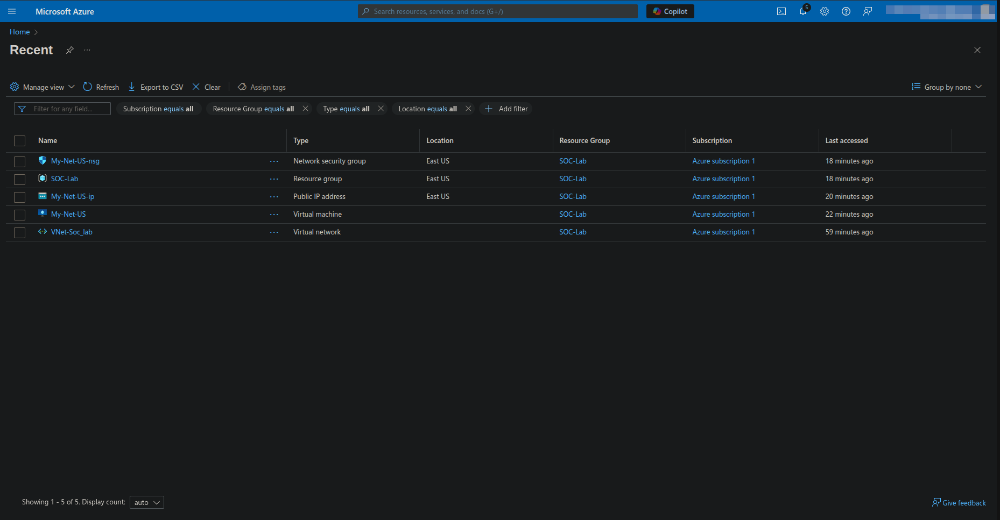

# Step 2: Configuring the Honeypot (*Removing Security Controls*)
1. **Modify Network Security Group (NSG):**
  - By default, RDP (Remote Desktop Protocol) is the only allowed inbound connection.
  - Delete the default RDP rule and allow all inbound traffic to attract attackers.
2. **Disable Windows Firewall:**
   - Use RDP to access the VM.
   - Open `wf.msc`, Set all firewall properties to Off.
3. **Verify External Reachability:**
   - Ping the VM from your local machine to confirm it's reachable.

### Initial Connection Using RDP:
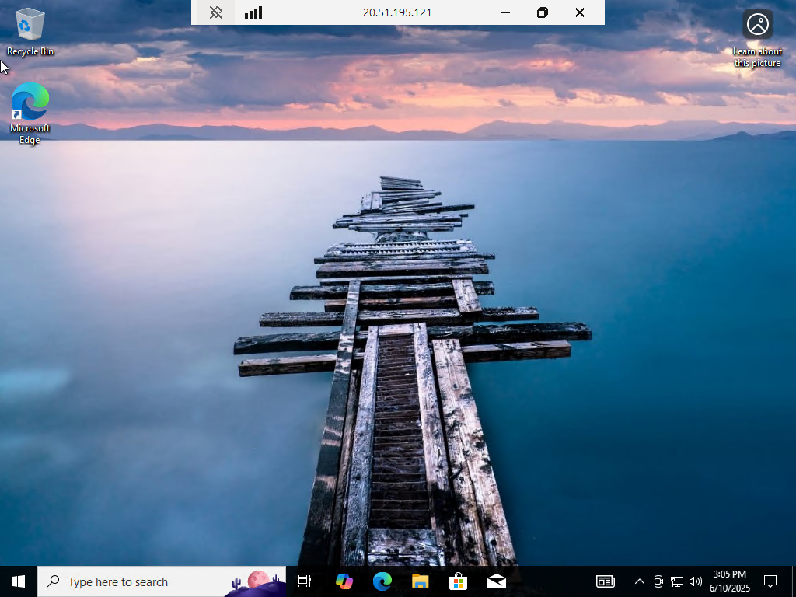

### Firewall Status of ON:
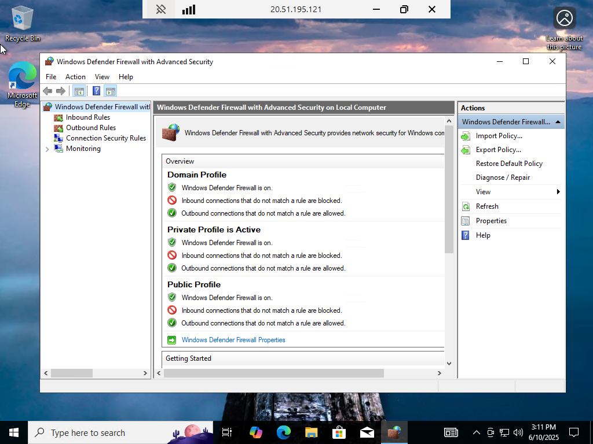

### Disabling Each Part of Windows Firewall:
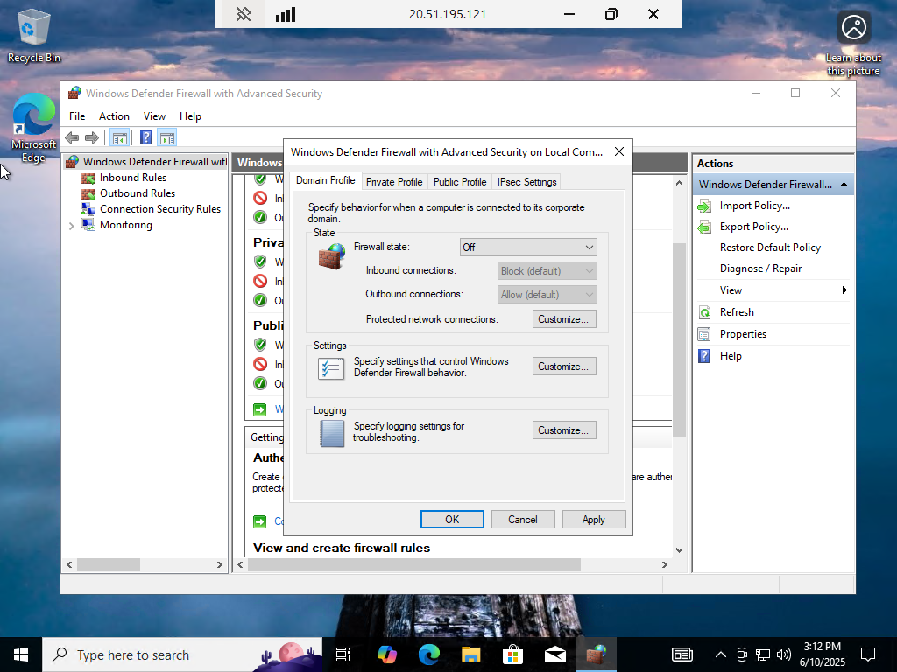
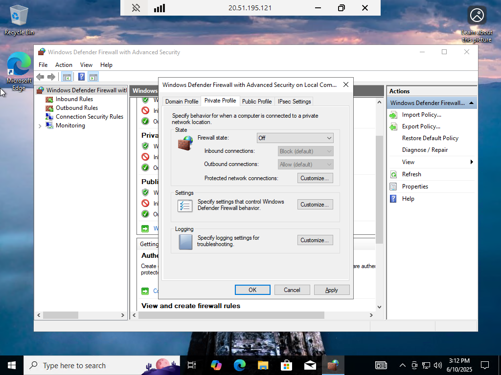

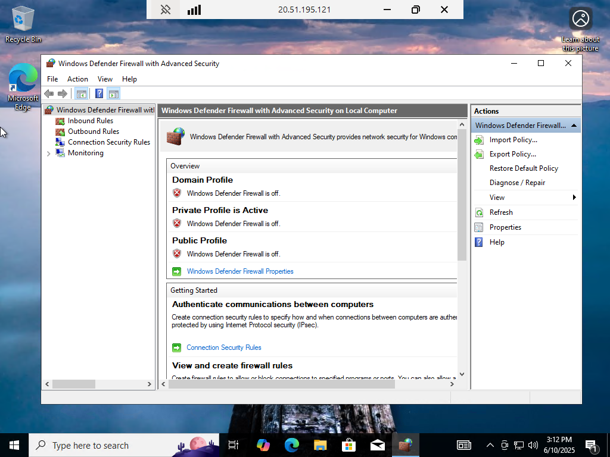

# Step 3: Enable Logging & Forwarding Data
1. **Verify Local Logging:**
   - Attempt incorrect login credentials to generate failed login logs.
   - Open Event Viewer - Navigate to Security Attempts
   - Locate Event ID 4625 (*failed login attempts*)
2. Create LAW(Log Analytics Workspace):
   - This serves as the central repository for security logs.

### Event Viewer For Failed Login Attempts:
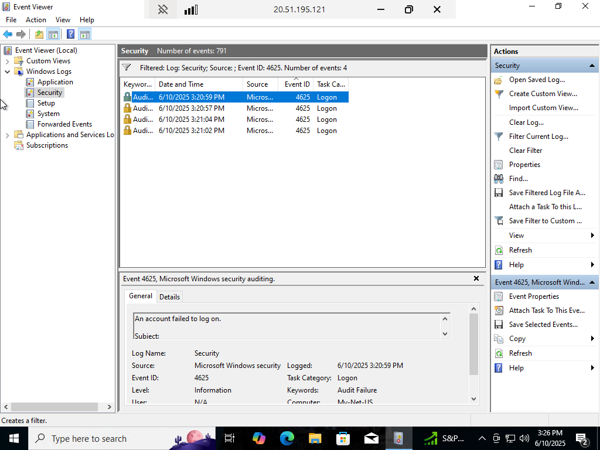

### Event Viewer 4625:
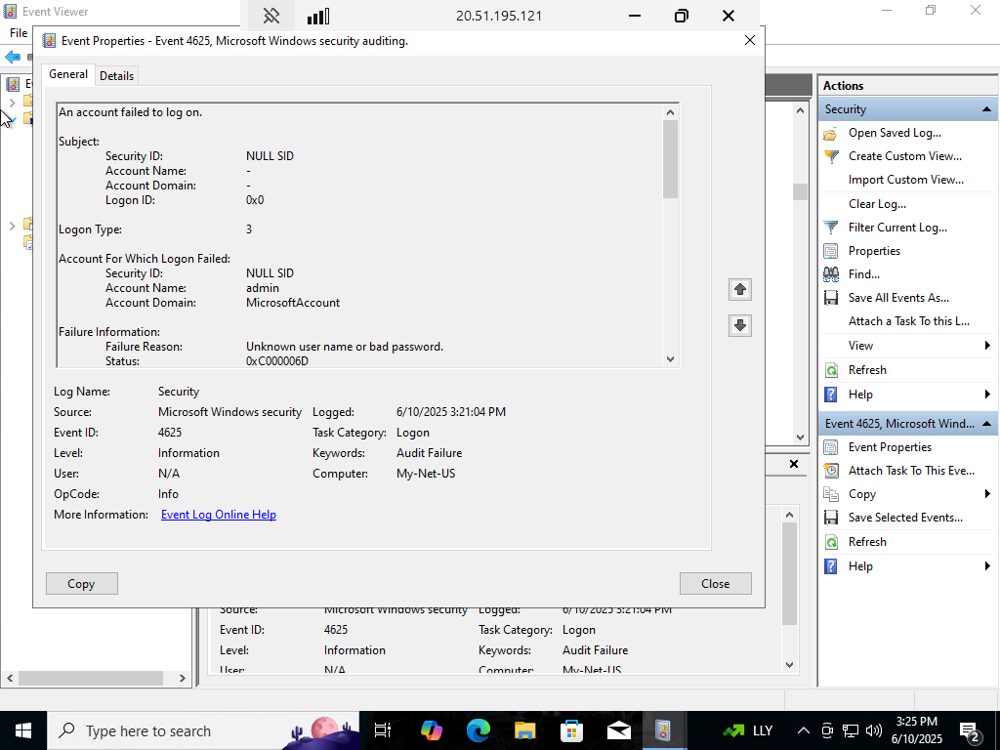

### LAW Creation
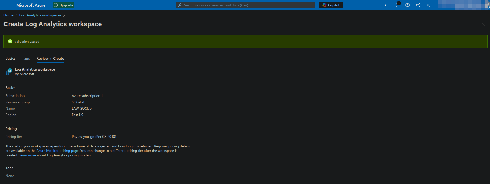

# Step 4: Deploying Microsoft Sentienel (SIEM)
1. **Create a Sentinel Instance - Azure's Security Information and Event Management (SIEM) tool.**
2. **Install Windows Security Events Connector:**
   - Select Windows Security Events via AMA (Azure Montoring Agent).
   - Create a Data Collection Rule (DCR) to forward logs.
3. **Wait for Log Collection:**
   - Logs may take 1-2 hours to populate.

### Initial Failed Login Attempts via Microsoft Sentienel
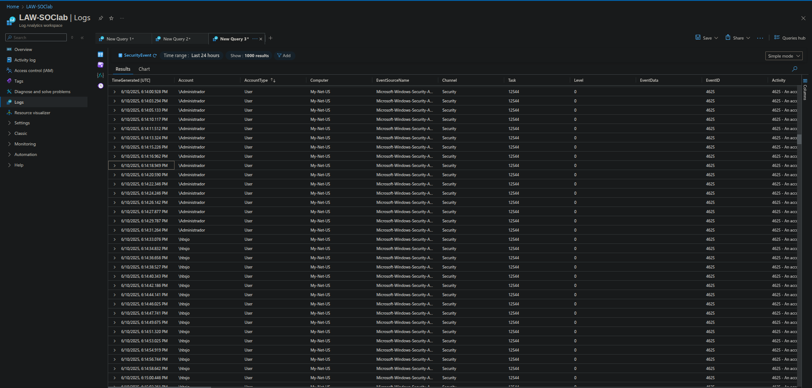

# Step 5: Observing Real Attacks
1. **Analyze Failed Login Attempts:**
   - Multiple failed login attempts observed from different username (`Admin`, `Administrator`, `usuario`, `Cuentas`)
   - All the initial login attempts originated from the same IP address, indicating a brute-force attack likely from an automated script.
2. **Querying Security Events for Failed Logins:**
   - To identify failed login attempts (*Event ID 4625*) use the following KQL query in Microsoft Sentienel:
   - `kql
SecurityEvent
| where EventID == 4625`

# Step 6: Enriching Logs with Geolocation Data
1. **Create a Watchlist in Microsoft Sentinel:**
   - Upload a GeoIP file to map attacker IP addresses to geographic locations.
   - File used: [geoip-summarized.csv](https://github.com/user-attachments/files/20694215/geoip-summarized.csv)
2. **Query Logs using KQL with Geolocation Data:**
   - `let GeoIPDB_FULL = _GetWatchlist("geoip");
let WindowsEvents = SecurityEvent
    | where EventId == 4625
    | evaluate ipv4_lookup(GeoIPDB_FULL, IpAddress, network);
WindowsEvents`

### Watchlist Creation:
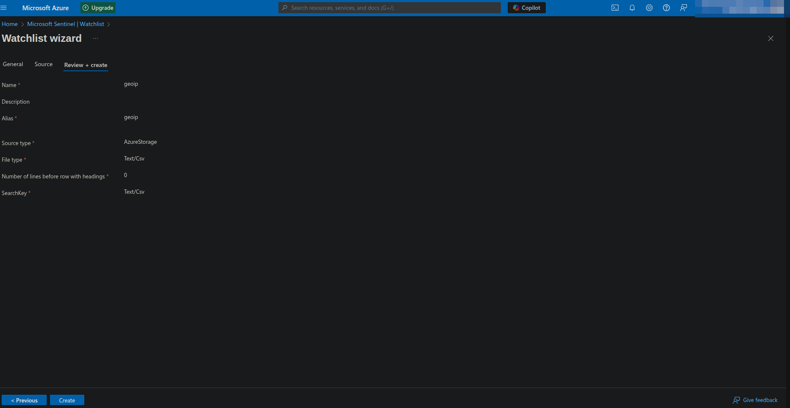

# Step 7: Attack Map Visualization
1. **Create a Sentinel Workbook to visualize attack locations.**
2. **Add a Query Element and paste the following JSON data:**
   - `{
    "type": 3,
    "content": {
        "version": "KqlItem/1.0",
        "query": "let GeoIPDB_FULL = _GetWatchlist(\"geoip\");\nlet WindowsEvents = SecurityEvent;\nWindowsEvents | where EventID == 4625\n| order by TimeGenerated desc\n| evaluate ipv4_lookup(GeoIPDB_FULL, IpAddress, network)\n| summarize FailureCount = count() by IpAddress, latitude, longitude, cityname, countryname\n| project FailureCount, AttackerIp = IpAddress, latitude, longitude, city = cityname, country = countryname,\nfriendly_location = strcat(cityname, \" (\", countryname, \")\");",
        "size": 3,
        "timeContext": {
            "durationMs": 2592000000
        },
        "queryType": 0,
        "resourceType": "microsoft.operationalinsights/workspaces",
        "visualization": "map",
        "mapSettings": {
            "locInfo": "LatLong",
            "locInfoColumn": "countryname",
            "latitude": "latitude",
            "longitude": "longitude",
            "sizeSettings": "FailureCount",
            "sizeAggregation": "Sum",
            "opacity": 0.8,
            "labelSettings": "friendly_location",
            "legendMetric": "FailureCount",
            "legendAggregation": "Sum",
            "itemColorSettings": {
                "nodeColorField": "FailureCount",
                "colorAggregation": "Sum",
                "type": "heatmap",
                "heatmapPalette": "greenRed"
            }
        }
    },
    "name": "query - 0"
}
`
3. **Observe the attack map, showing where login attempts originate.**

### Initial Attack Map ~2 Hours:
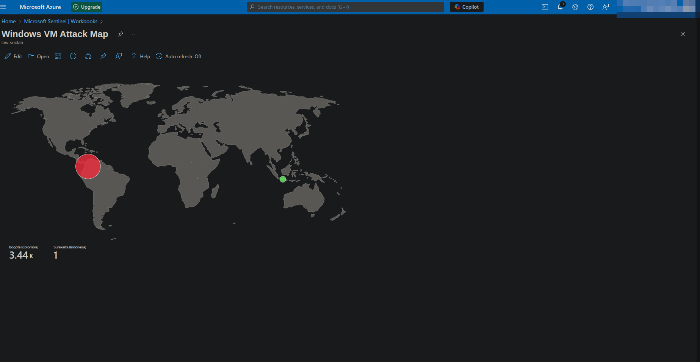

### Attack Map After ~24 Hours:
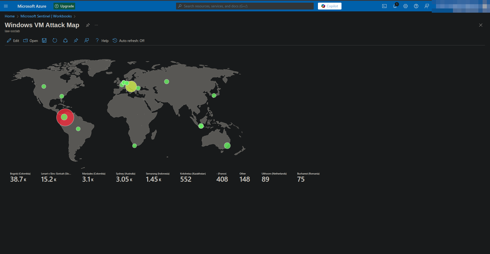

# Real-World Application
   - **Threat Intelligence** - Observe live attack attempts from real-world adversaries
   - **Log Analysis Practice** - Gain hands-on experince with KQL queries and SIEM operations

# Resources used:
- Josh Madakor - Cyber Home Lab from Zero and Catch Attackers. Youtube
